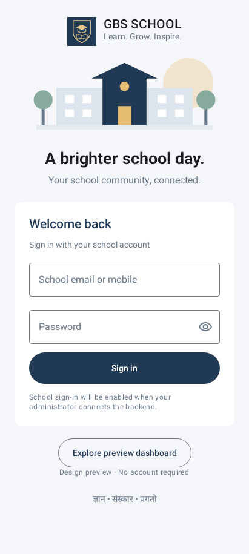
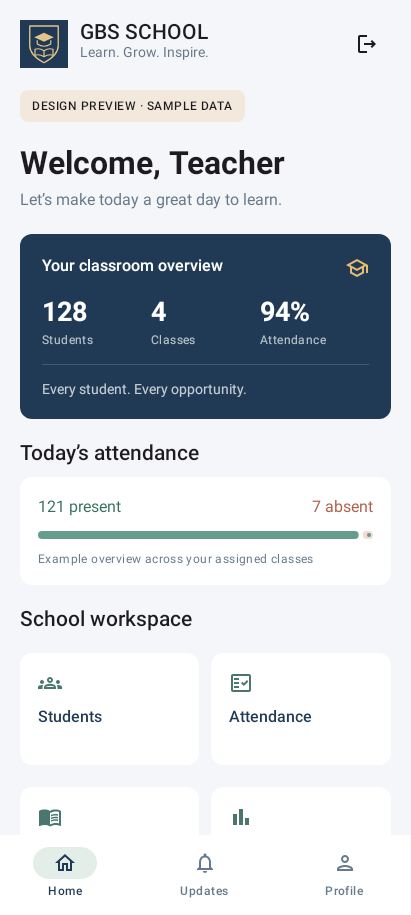

# Login + Dashboard review

These screenshots are rendered from the app's actual Jetpack Compose UI by the local Android test runtime at 411 × 915 dp. They are not design mockups. System status/navigation bars are not included in these test captures.

## Login

School branding, campus artwork, accessible password visibility control, validation, and a separate debug-only preview entry. Authentication remains unconnected.

## Dashboard

Clearly labelled fictional classroom/attendance data, scrollable module shortcuts and a school noticeboard. The remaining modules display a next-phase notice. Back or the exit icon returns to Login.

## Run on an Android device

Install [the debug APK](app/build/outputs/apk/debug/app-debug.apk), then tap **Explore preview dashboard**. This build makes no school-data requests. Device testing is still required before release.

The next milestone can introduce OTP and module screens after this design is reviewed. No further business logic is implemented in this delivery.
